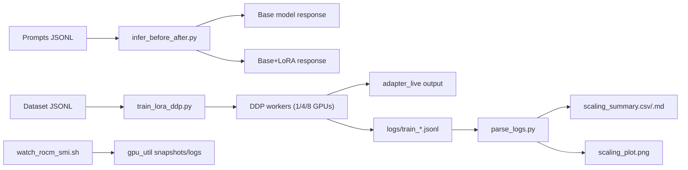

# System Design: Enterprise Assistant + ROCm Multi-GPU Scaling

## 1) Scope and demo contract

This design produces three proof points in one flow:

1. **Business relevance**: enterprise support/policy assistant prompt set.
2. **Real distributed execution**: live DDP LoRA fine-tune on LUMI GPUs.
3. **Measured scaling**: 1 vs 4 vs 8 GPU tokens/s, step time, efficiency.

## 2) Chosen technical stack (exact defaults)

- **Base model (default)**: `Qwen/Qwen2.5-7B-Instruct`
- **Fallback model**: `Qwen/Qwen2.5-3B-Instruct`
- **Adapter method**: LoRA (PEFT), train adapters only
- **Precision**: `bf16`
- **Distributed**: `torch.distributed` + `DDP`, launcher `torchrun`
- **Optimizer**: `AdamW`
- **Scheduler**: cosine with warmup
- **Sequence length**: `1024` (demo-safe), optional `2048` precompute run
- **Dataset format**: JSONL with `prompt`/`response` or `messages`

## 3) Runtime architecture



## 4) Repository structure

```text
configs/
  model_qwen25_7b.yaml
  train_lora_demo.yaml
  train_lora_fallback_3b.yaml
scripts/
  infer_before_after.py
  train_lora_ddp.py
  parse_logs.py
run-scripts/
  run_1gpu.sh
  run_4gpu.sh
  run_2node_8gpu.sh
  watch_rocm_smi.sh
docs/
  ENVIRONMENT.md
  SYSTEM_DESIGN.md
  DEMO_RUNBOOK.md
prompts/
  demo_prompts.jsonl
data/
  demo_support_subset.sample.jsonl
artifacts/
logs/
```

## 5) Training design details

### 5.1 Data contract

Each JSONL row is one sample, one of:

- `{ "prompt": "...", "response": "..." }`
- `{ "question": "...", "answer": "..." }`
- `{ "messages": [{"role": "system|user|assistant", "content": "..."}, ...] }`

The trainer normalizes each row to a chat-style text sequence and computes Causal LM loss.

### 5.2 LoRA config (default)

- `r=16`
- `lora_alpha=32`
- `lora_dropout=0.05`
- `target_modules=[q_proj,k_proj,v_proj,o_proj,gate_proj,up_proj,down_proj]`
- `bias=none`
- `task_type=CAUSAL_LM`

### 5.3 Optimization config (default)

- `global_batch_size`: 64 tokens-batches effective
- `micro_batch_size_per_gpu`: 2
- `gradient_accumulation_steps`: 8 (for 4 GPUs; tune per world size)
- `max_steps`: 150 live demo, 400 precompute
- `lr`: `2e-4`
- `weight_decay`: `0.01`
- `warmup_steps`: `20`
- `max_grad_norm`: `1.0`
- `logging_steps`: `5`
- `save_steps`: `50`

### 5.4 DDP assumptions

- Backend: `nccl`
- One process per GPU (`torchrun --nproc_per_node=N`)
- Rank 0 writes structured JSONL logs
- `DistributedSampler` for deterministic shard splits

## 6) Inference design details

`infer_before_after.py`:

- Loads base model once per invocation.
- If `--adapter_path` is set, wraps model with PEFT adapter.
- Uses fixed generation config to keep output stable:
  - `temperature=0.2`
  - `top_p=0.9`
  - `max_new_tokens=220`
  - `seed=42`
- Prints and optionally writes JSONL outputs for replay/fallback.

## 7) Scaling metrics definitions

For each run config, compute average over steady-state steps (skip warmup):

- `avg_step_time_s`
- `avg_tokens_per_s`
- `speedup = tokens_per_s(world_size=k) / tokens_per_s(world_size=1)`
- `efficiency = speedup / k`

Output artifacts:

- `artifacts/scaling_summary.csv`
- `artifacts/scaling_summary.md`
- `artifacts/scaling_plot.png`

## 8) Operational defaults for demo reliability

- Pre-cache model on scratch before event.
- Keep live run short (150 steps).
- Prefer 4-GPU single-node live run.
- Keep 8-GPU numbers precomputed unless network is already rehearsed.
- Maintain fallback chain: live -> semi-live -> recorded.

## 9) Exact launch matrix

- `run_1gpu.sh`: 1 node x 1 GPU, 80 steps, baseline throughput
- `run_4gpu.sh`: 1 node x 4 GPUs, 150 steps, main live demo
- `run_2node_8gpu.sh`: 2 nodes x 4 GPUs/node, 200 steps, precomputed scaling

## 10) Acceptance checks

- Rank 0 log includes `world_size`, `step_time_s`, `tokens_per_s` every 5 steps.
- `rocm-smi` shows non-zero GPU activity on target GPUs.
- Prompt outputs clearly differ before/after using `adapter_demo`.
- Scaling summary shows monotonic throughput improvement from 1 -> 4 -> 8.

