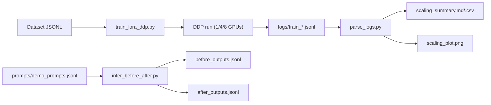

# System Design

## Goal

Show three things clearly:

1. Distributed LoRA training works on LUMI-G.
2. Throughput scales from 1 to 4 to 8 GPUs.
3. Optional before/after inference can show quality change with an adapter.

## Core components

- `scripts/train_lora_ddp.py`: LoRA training with DDP and JSONL logging.
- `run-scripts/run_1gpu.sh`, `run_4gpu.sh`, `run_2node_8gpu.sh`: launchers for 1/4/8 GPU runs.
- `scripts/parse_logs.py`: builds scaling table and plot.
- `scripts/infer_before_after.py`: compares base model vs base+adapter outputs.
- `run-scripts/watch_rocm_smi.sh`: lightweight GPU monitoring.

## Runtime flow

```mermaid
flowchart LR
    A["Dataset JSONL"] --> B["train_lora_ddp.py"]
    B --> C["DDP run (1/4/8 GPUs)"]
    C --> D["logs/train_*.jsonl"]
    D --> E["parse_logs.py"]
    E --> F["scaling_summary.md/.csv"]
    E --> G["scaling_plot.png"]

    H["prompts/demo_prompts.jsonl"] --> I["infer_before_after.py"]
    I --> J["before_outputs.jsonl"]
    I --> K["after_outputs.jsonl"]
```

## Data format

Training rows can be one of:

- `{ "prompt": "...", "response": "..." }`
- `{ "question": "...", "answer": "..." }`
- `{ "messages": [...] }`

## Scaling metrics

From steady-state training steps:

- `avg_step_time_s`
- `avg_tokens_per_s`
- `speedup = tokens_per_s(k) / tokens_per_s(1)`
- `efficiency = speedup / k`

## Success checks

- Logs contain regular `step_time_s` and `tokens_per_s` entries.
- `rocm-smi` shows active GPUs during run.
- Scaling summary shows throughput increase from 1 -> 4 -> 8.
- Optional: before/after outputs differ when adapter is loaded.
